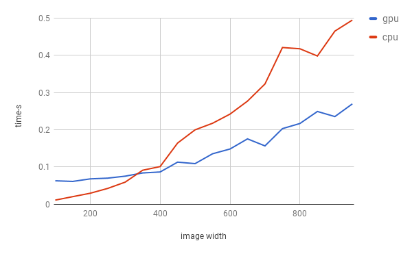

# cv-gpu-py
==================

Python wrapper for OpenCV C++ gpu::PyrLKOpticalFlow and gpu::OpticalFlowDual_TVL1_GPU . Based on [pyboostcvconverter](https://github.com/Algomorph/pyboostcvconverter).

## Compatibility
-----------------
This code is tested on OpenCV 2.4.13 with CUDA and python 2.7.

## Compiling & Trying Out Sample Code
----------------------
1. `mkdir build; cd build; cmake ..; make`
2. copy to python lib path e.g.,: `cp pbcvt.so ~/.local/lib/python2.7/site-packages/`
3. Run python interpreter of your choice,
  1. import pbcvt; import numpy as np
  2. pbcvt.set_dev(4, 10, 1)  # use device 4, window size 10 and maxlevel 1
  3. st,p1 = pbcvt.pbcvt.pyrlk_optflow_spr(im0,im1,p0,p1)  # points are in shape(1,n,2)
  4. t0,t1 = pbcvt.optflow_tvl1_gpu(im0,im1)  # tvl1
  5. pbcvt.rel_mem()  # release gpu  
(refer to test_lk.py)

## Notes
---------------------
- should import pbcvt before cv2

## Test
for 100 caculations, pyrlk with 16 points:

  

